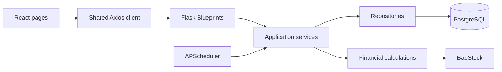

# Architecture

## Overview



The application remains a single deployable system, but responsibilities are separated so that HTTP, business rules, persistence, and financial calculations can change independently.

## Backend boundaries

| Layer | Location | Responsibility |
| --- | --- | --- |
| Entry point | `finance-calculator-flask/finance-calculator.py` | Create and run the Flask application |
| Application setup | `finance-calculator-flask/app/__init__.py` | Configuration, extensions, logging, blueprints, scheduler startup |
| Routes | `finance-calculator-flask/app/routes/` | Parse HTTP input and format HTTP responses |
| Services | `finance-calculator-flask/app/services/` | Validation, transactions, imports, analysis, VaR, scheduled jobs |
| Repositories | `finance-calculator-flask/app/repositories/` | Database query construction |
| Models | `finance-calculator-flask/app/models.py` | Persistent data structure |
| Domain calculations | `finance-calculator-flask/class_file/` | Market data retrieval and calculation functions |

Routes must not issue database queries directly. Services own commit and rollback boundaries. Repository functions do not commit transactions.

## Configuration

Local settings come from the root `.env` file and process environment variables. Production deployments should provide environment variables through the hosting platform. Secrets must not be stored in tracked source files.

The scheduler is disabled by default. Set `RUN_SCHEDULER=true` for one process only; running it in every web worker would execute jobs more than once.

## Data integrity

A holding is identified by this composite key:

```text
trade_date + company + department + portfolio_code + stock_symbol
```

Update and delete operations require the complete key. Scheduled replacement prepares market data before deleting existing records, then performs deletion and insertion in one transaction.

## Compatibility

The existing browser routes and API paths are preserved. The refactor changes internal ownership and error semantics: conflicts use HTTP `409`, invalid input uses `400`, and missing data uses `404`.
